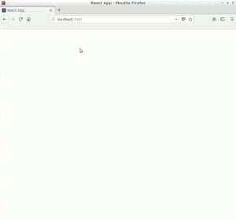

NAME
----

react-d3-twitter-streaming-sentiment-plot

DESCRIPTION
-----------

You can check it here: <https://t.co/YtWsRctbYY>

This application creates a summary showing streaming activity on Twitter from certain places in real time. For this I am using React and D3 in the frontend and Nodejs + Express in the backend. 

      
Twitter provides a streaming API, which provides a subset of real-time tweets. For this purpose, it establishes a permanent connection with the Twitter servers and receives a continuous flow of tweets in json format. Through API streaming you can use hashtags to download more than 500 GB of data from more than 200,000 tweets of any event that is taking place in real time.
      
Twitter makes up to 1% of all tweets available in real time through a random sampling technique that represents the larger population of tweets and exposes these tweets through the Streaming API. 
      
However, by scraping the Twitter search page and using its filters, you can perform searches that may be more interesting than those provided by the API. And that is the method I have used here.

An example of a search for the latest tweets containing the word "saturday" and near London would be: <https://twitter.com/search?f=tweets&vertical=news&q=saturday%20near%3Alondon&src=typd>

Sentiment analysis
------------------

In this application I have used a run & gun sentiment analysis (check this very interesting module: <https://github.com/thinkroth/Sentimental>) that can be improved in many ways: text standardization, characterization and vectorization, etc.
                

Installation
-----------

The sections of this project corresponding to the frontend and a good part of the backend are available. However, due to the technique of extracting the information from the tweets, the code corresponding to the scraping method is not included in this repository. 

Disclaimer
----------

Web Scraping is a controversial topic. Scraping data for personal use within certain limits should not be a problem,but permission must always be obtained from the website owner before doing so. My example here makes a minimum number of requests, and obviously does not interfere with Twitter's performance. In any case, and precisely because of the doubts that its use may raise, the code that performs the scraping has not been included in the repository.

According to the Twitter API usage policy, it is prohibited to redistribute tweets that include explicit information about the identity of users. However, redistribution is permitted if these fields are removed.
